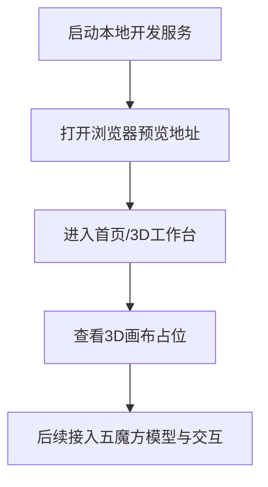

## 1. 产品概述
五魔方 3D 建模网站是一个面向桌面端优先的浏览器预览项目，短期目标是搭建可运行的网站框架，为后续实现五魔方模型、交互控制与解法演示打基础。
- 主要用途：在本地浏览器中预览 3D 场景、承载后续五魔方模型与交互功能。
- 目标价值：提供清晰、可扩展的前端工程骨架，降低后续 3D 建模和交互开发成本。

## 2. 核心功能

### 2.1 功能模块
1. **首页 / 3D 工作台**：项目介绍、预留 3D 画布区域、开发状态信息、本地预览入口。
2. **开发框架**：基础路由结构预留、组件目录预留、样式系统预留、3D 场景模块预留。

### 2.2 页面详情
| 页面名称 | 模块名称 | 功能描述 |
| --- | --- | --- |
| 首页 | 顶部导航 | 展示项目名称、短期目标、后续功能入口占位 |
| 首页 | 3D 预览画布占位 | 展示五魔方 3D 建模区域的占位状态，后续接入 WebGL 场景 |
| 首页 | 里程碑卡片 | 标记项目初始化、3D 场景、五魔方几何体、交互控制等阶段 |
| 首页 | 技术说明 | 简要说明当前框架和后续计划 |

## 3. 核心流程
用户启动本地开发服务后，在浏览器打开本地地址，进入首页查看 3D 工作台占位与项目阶段说明；后续开发会逐步替换占位画布为真实五魔方模型。

## 4. 用户界面设计

### 4.1 设计风格
- 主色：深墨蓝与近黑背景，突出 3D 工作台氛围。
- 辅色：青绿色高亮，用于强调 WebGL、建模状态和关键按钮。
- 按钮风格：细边框、轻微发光、圆角矩形。
- 字体与字号：使用清晰的无衬线字体栈，标题偏大，正文保持高可读性。
- 布局风格：桌面优先，中心 3D 画布区域配合左右说明卡片。

### 4.2 页面设计概览
| 页面名称 | 模块名称 | UI 元素 |
| --- | --- | --- |
| 首页 | 顶部导航 | 项目名称、短期目标标签、状态提示 |
| 首页 | Hero 区域 | 大标题、说明文案、本地预览提示 |
| 首页 | 3D 画布占位 | 线框五边形/网格背景、后续模型区域提示 |
| 首页 | 里程碑 | 卡片式步骤、当前阶段高亮 |

### 4.3 响应式
桌面优先；在窄屏下将说明卡片堆叠到画布下方，保留核心预览区域。

### 4.4 3D 场景指导
- 环境氛围：暗色工作台、低对比网格、局部高亮。
- 灯光设置：后续采用柔和环境光与斜向主光，突出五魔方棱角。
- 相机设置：透视相机，默认三分之二视角，支持轨道控制。
- 交互动画：后续支持旋转、缩放、单层转动动画。
- 性能预算：优先保持本地开发流畅，避免过早引入复杂后处理。
