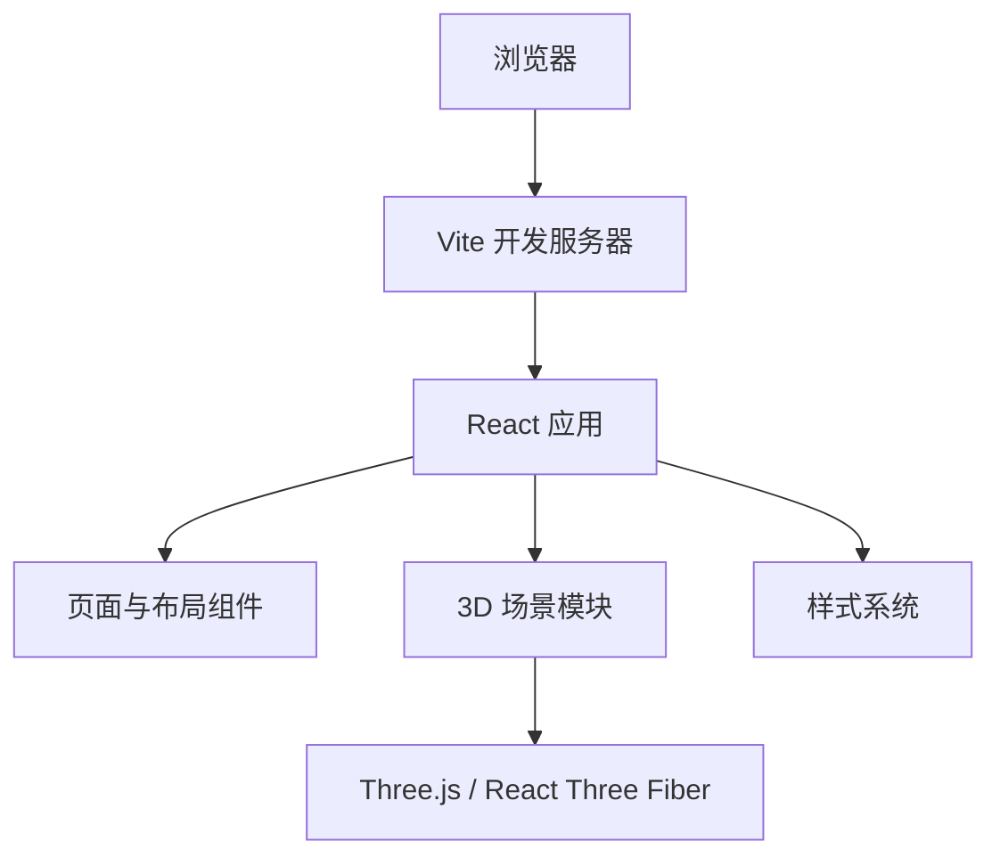

## 1. 架构设计
项目采用纯前端架构，短期只初始化可运行的网站框架，不引入后端与数据库。后续五魔方 3D 建模逻辑将集中在前端 3D 场景模块中。

## 2. 技术说明
- 前端：React 18 + TypeScript + Vite
- 样式：CSS Modules 或普通 CSS，初始阶段保持轻量；后续可按需要引入 Tailwind CSS
- 3D：预留 three、@react-three/fiber、@react-three/drei 的接入位置
- 初始化工具：Vite
- 后端：无
- 数据库：无

## 3. 路由定义
| 路由 | 用途 |
| --- | --- |
| / | 首页与 3D 工作台占位 |

## 4. API 定义
当前阶段无后端 API。后续如需要保存模型状态、解法步骤或用户配置，可再引入本地存储或服务端接口。

## 5. 前端目录规划
| 路径 | 用途 |
| --- | --- |
| src/App.tsx | 应用入口组件，组合首页结构 |
| src/main.tsx | React 挂载入口 |
| src/styles.css | 全局样式与页面视觉框架 |
| src/components/ | 可复用 UI 组件目录 |
| src/scene/ | 后续 3D 场景、五魔方模型与交互逻辑目录 |

## 6. 后续扩展方向
- 接入 React Three Fiber 并替换当前 3D 占位画布。
- 建立五魔方几何数据结构，分离模型数据、渲染和交互控制。
- 增加 OrbitControls、层转动动画、状态记录和调试面板。
- 在模型稳定后补充单元测试与关键交互测试。
